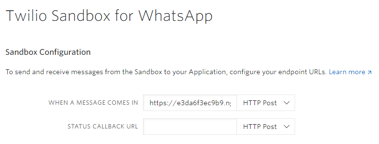

### ISA-IPA-2020-11-15-IS01FT-GRP3-Virtual-Renting-Assistant
## SECTION 1 : PROJECT TITLE
## Virtual Renting Assistant


---

## SECTION 2 : EXECUTIVE SUMMARY / PAPER ABSTRACT

Finding a suitable residence is one of the basic necessities that everyone needs. Currently there are various websites and applications which can list all the houses’ information within a district. However, the explosion of housing information arises troubles not only for housing tenants but also sellers. To help tenants select a suitable residents without exposure to oceans of information and also reduce the heavy load of sellers, we design and develop a Virtual Renting Assistant (VRA) using Google Dialogflow, Twilio sandbox, website scraper and clustering analysis.

---

## SECTION 3 : CREDITS / PROJECT CONTRIBUTION

| Official Full Name  | Student ID (MTech Applicable)  | Work Items (Who Did What) | Email (Optional) |
| :------------ |:---------------:| :-----| :-----|
| CAO Zi Hao | A0215407M | <ol type="a"><li>System design</li><li>Conversation workflow design</li><li>Dialogflow design and implementation</li><li>Demo video and Project report</li></ol> | e0535497@u.nus.edu |
| WANG Si Xiang | A0215475A | <li>Set up web server</li><li>Twilio interaction</li><li>PDF generation</li><li>Testing</li> | e0535565@u.nus.edu |
| ZHANG Jiu Yun | A0215513R | <ol type="a"><li>Market research and System design</li><li>Clustering analysis</li><li>Conversation platform development</li><li>Project Report</li></ol> | e0535603@u.nus.edu |
| ZUO Zong Yuan | A0215291L | <li>Web scraper</li><li>Finite State Machine</li><li>Dialogflow interaction</li><li>Project report</li> | e0535381@u.nus.edu |

---

## SECTION 4 : VIDEO OF SYSTEM MODELLING & USE CASE DEMO

---

## SECTION 5 : USER GUIDE
4.1 Installation and User Guide 

> Refer to appendix <Installation & User Guide> in project report at Github Folder: ProjectReport

Please make sure you are using Node.js 12.0.0 or higher (see `Node.js` column in [combatibility table](https://developer.mozilla.org/en-US/docs/Web/JavaScript/Reference/Global_Objects/Object/fromEntries#Browser_compatibility)).

1. - Download the source file and extract, or
   - Clone the repository from git:  
    `git clone https://github.com/nus-iss-isa-pm-group-3/ISA-IPA-2020-11-15-IS01FT-GRP3-Virtual-Renting-Assistant.git`
1. `cd` to the `SystemCode` directory, run the following command in terminal:
   - For production:  
     ```
     npm install --production
     npm start
     ```
   - For development:  
     ```
     npm install --production=false
     npm run dev
     ```
1. Configure Twilio
   1. [Sign up for Twilio and activate the Sandbox](https://www.twilio.com/docs/whatsapp/quickstart/node?code-sample=code-send-a-message-with-whatsapp-and-nodejs&code-language=Node.js&code-sdk-version=3.x#sign-up-for-twilio-and-activate-the-sandbox)
      > Before you can send a WhatsApp message from your web language, you'll need to sign up for a Twilio account or sign into your existing account and activate the Twilio Sandbox for WhatsApp. It allows you to prototype with WhatsApp immediately using a shared phone number, without waiting for a dedicated number to be approved by WhatsApp.

      > To get started, select a number from the available sandbox numbers to activate your sandbox.

      > 

      > Be sure to take note of the phone number you choose in the Sandbox. You will need this later when we're ready to send some messages.
   1. [Connect the Sandbox to the server](https://www.twilio.com/docs/whatsapp/quickstart/node?code-sample=code-send-a-message-with-whatsapp-and-nodejs&code-language=Node.js&code-sdk-version=3.x#receive-and-reply-to-messages-from-whatsapp)
      > When someone replies to one of your messages, you will receive a webhook request from Twilio.

      > You can configure webhooks by connecting your Sandbox to an app you've already built for handling incoming messages, or build a new one for WhatsApp messages.

      

      **Note:** The webhook URL should either be your distributed service URL (production) or the URL shown in terminal in step 2 (development).

---

## SECTION 6 : PROJECT REPORT / PAPER
Nowadays the housing prices in Singapore has become increasingly expensive, which lead to the fact that more and more people have to rent house. In order to help tenants find a suitable residence, lots of real estate companies now will list the house information on various websites. However, the flood of the unstructured lease information can increase the time of finding useful information and waste the users’ time. Besides, a majority group of these tenants are foreign students who may have trouble accessing these websites, let alone extracting information. Moreover, the demand of online renting could witness a huge increase in these two years considering the limited physical interaction among people due to COVID-19.  

[Download the Project Report](ProjectReport/IPA%20report.pdf)

---
